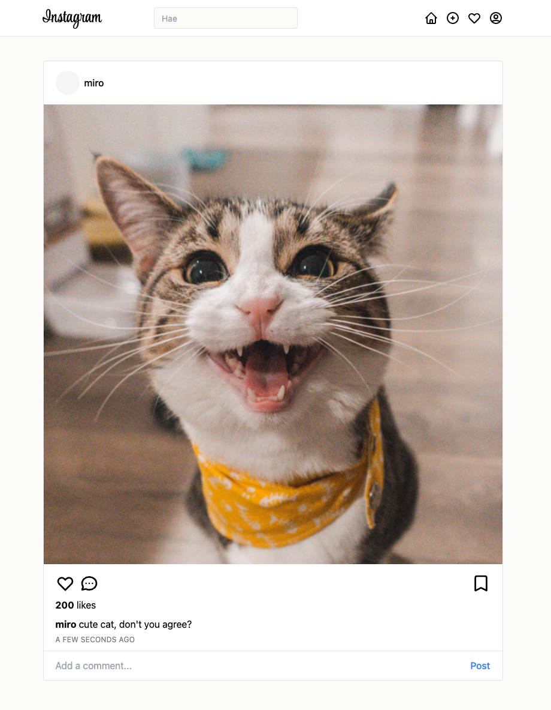

# Instagram Clone

A simple Instagram Clone with React and Express.js.

View video: https://www.youtube.com/watch?v=4hcuBTUh5TY

## Screenshot



## Development

Prerequisites:
- MySQL server
- S3 bucket with credentials set to an `.env` file like in `.env.sample`

### Start the backend

```
git clone https://git.rauhala.dev/mimsee/instagram-clone.git
cd instagram-clone
npm install && npm run dev
```

### Start the frontend
To get a preview of the frontend, run the following commands.

```
cd ./frontend
npm install && npm run start
```

